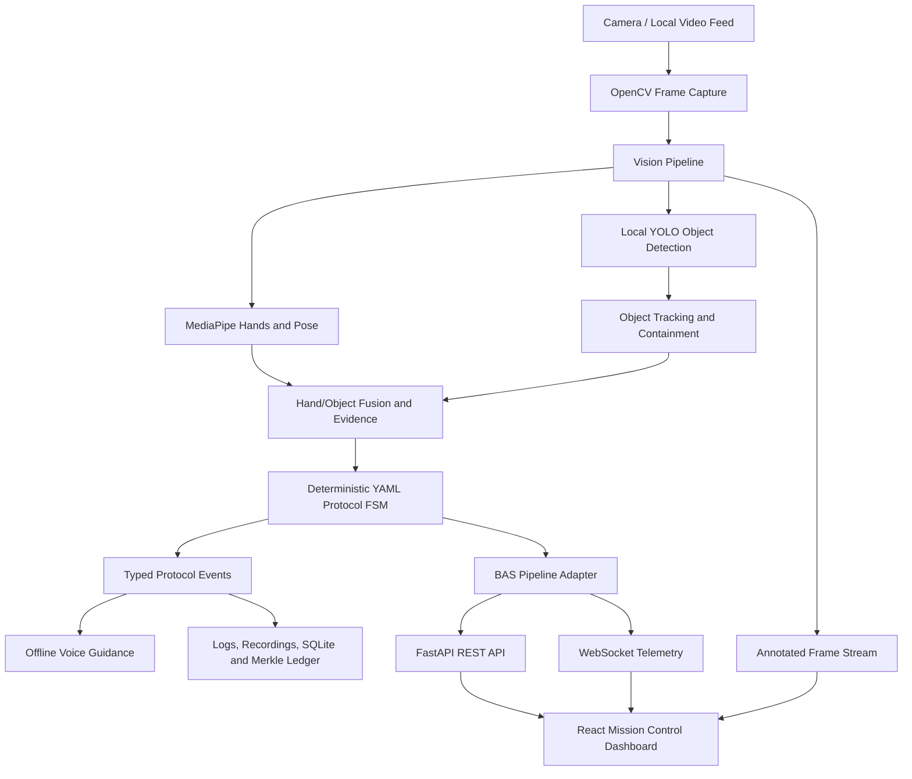

<div align="center">

# 🛰️ AEGIS — BAS Onboard AI Assistant

**An edge-ready, real-time AI human-activity recognition system for safe, deterministic BAS experiment operations.**

[](https://www.sih.gov.in/)
[](https://www.python.org/)
[](https://fastapi.tiangolo.com/)
[](https://react.dev/)
[](#offline-and-safety)

[Features](#-key-features) • [Architecture](#-system-architecture) • [Getting Started](#-getting-started) • [API](#-api-reference) • [Testing](#-testing)

</div>

---

## 📌 Project Overview

**AEGIS** is an onboard assistant for Bharatiya Antariksh Station (BAS) experiments, built for Smart India Hackathon 2026 problem statement **SIH26174**. It observes experiment procedures using a local camera, identifies hands and experiment objects, validates every action against an approved finite-state protocol, and presents real-time guidance through a mission-control dashboard.

The system runs locally: its vision models, safety validation, voice alerts, telemetry, and persistence do not require cloud AI services or runtime model downloads.

---

## ✨ Key Features

- **🎥 Offline computer vision:** OpenCV capture, MediaPipe hand/pose landmarks, and local YOLO object detection.
- **🧠 Interaction reasoning:** Tracks hand-to-object contact, containment, removal, return, and dwell-time evidence.
- **⚡ Deterministic protocol FSM:** YAML-defined, order-sensitive experiment validation with safety violations and recovery handling.
- **🛡️ Aerospace safety layer:** Hazard monitoring for glare, free-object drift, immobility, environmental conditions, and hardware health.
- **🔊 Grounded operator guidance:** Non-blocking, local text-to-speech alerts constrained by live protocol state.
- **📡 Real-time telemetry:** FastAPI REST endpoints and WebSocket telemetry for live mission operations.
- **📊 Mission-control dashboard:** React, Vite, and Tailwind interface with video overlays, alerts, audit replay, digital twin, and protocol progress.
- **🗃️ Auditable persistence:** SQLite by default, structured logs, recordings, and a cryptographic Merkle ledger service.

---

## 🏗️ System Architecture



### Technical workflow

1. **Perception:** A local camera or video source supplies frames to pose, hand, and object perception.
2. **Evidence fusion:** Spatial relationships are converted into reliable interaction evidence.
3. **State evaluation:** The FSM compares that evidence with the approved experiment sequence.
4. **Response and audit:** AEGIS emits visual/voice guidance, safety alerts, telemetry, recordings, and verifiable event history.

---

## 🚀 Getting Started

### Prerequisites

- Python 3.10+
- Node.js 18+ and npm
- A local camera for live monitoring, or a local video file for replay

### 1️⃣ Install dependencies

On Windows, from the repository root:

```powershell
.\INSTALL_WEB.bat
```

Or install the components manually:

```powershell
python -m venv .venv
.venv\Scripts\Activate.ps1
pip install -r requirements.txt

cd frontend
npm install
```

### 2️⃣ Launch the operations console

```powershell
.\START_WEB_DASHBOARD.bat
```

| Service | URL |
| --- | --- |
| Mission-control dashboard | `http://localhost:5173` |
| FastAPI backend | `http://127.0.0.1:8000` |
| Interactive API documentation | `http://127.0.0.1:8000/docs` |
| Health check | `http://127.0.0.1:8000/health` |

To run services separately, use `.\START_BACKEND.bat` and `.\START_FRONTEND.bat`.

### 3️⃣ Run the computer-vision pipeline

```powershell
$env:PYTHONPATH = "$PWD\src;$PWD;$PWD\backend"
python scripts/run_pipeline.py --config configs/app.yaml --source 0
```

For a camera-free synthetic protocol demonstration:

```powershell
python scripts/run_sih_demo.py
```

---

## 🧪 Demo Scenarios

Use **Live Monitoring** in the dashboard to select an experiment and start a session. The console supports nominal, low-confidence, and violation scenarios, enabling demonstrations of live vision overlays, protocol step progression, grounded guidance, safety alerts, and auditable telemetry.

---

## ⚙️ Configuration

The main runtime configuration is [`configs/app.yaml`](configs/app.yaml). Protocol definitions are in [`configs/`](configs/), including the default visible-box procedure in [`configs/protocol.yaml`](configs/protocol.yaml).

| Setting | Purpose |
| --- | --- |
| `video_source` | Camera index, local video path, or stream URL |
| `frame_width`, `frame_height`, `target_fps` | Capture dimensions and timing |
| `objects_model_path` | Local object-detector model |
| `voice_enabled` | Enables offline voice alerts |
| `record_enabled` | Saves annotated recordings locally |
| `stream_enabled` | Enables the local MJPEG stream |
| `protocol_path` | YAML procedure evaluated by the FSM |

The backend reads optional environment variables from `.env`, including `DATABASE_URL`, `DEMO_MODE`, and `CONFIDENCE_THRESHOLD`. SQLite is used by default; PostgreSQL can be configured for deployment.

---

## 🔌 API Reference

| Method | Endpoint | Description |
| --- | --- | --- |
| `GET` | `/health` | Returns service health |
| `GET` | `/api/v1/dashboard` | Returns mission-control summary data |
| `GET` | `/api/v1/experiments` | Returns the experiment catalog |
| `POST` | `/api/v1/monitoring/start` | Starts a monitoring session |
| `POST` | `/api/v1/monitoring/stop/{id}` | Stops a monitoring session |
| `GET` | `/api/v1/monitoring/stream` | Serves the local MJPEG camera stream |
| `POST` | `/api/v1/assistant/chat` | Sends a state-grounded assistant request |
| `WS` | `/ws/monitoring` | Streams live monitoring telemetry |

---

## 🧪 Testing

```powershell
$env:PYTHONPATH = "$PWD\src"
python -m pytest tests/test_fusion_and_fsm.py tests/test_sih_box_protocol.py -q

cd frontend
npm run typecheck
npm run build
```

---

## 🔒 Offline and Safety

- All inference assets are local; the runtime does not download models or call external AI APIs.
- The protocol FSM is the authority for sequence progress and safety violations.
- Voice, recording, telemetry, and streaming are isolated from the frame-capture path.
- Camera tests and demonstrations can use synthetic or recorded data; a live camera is not required for validation.
- The dashboard displays operational truth from deterministic evidence rather than unrestricted model output.

---


