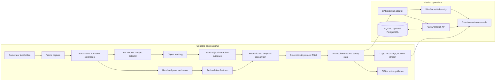
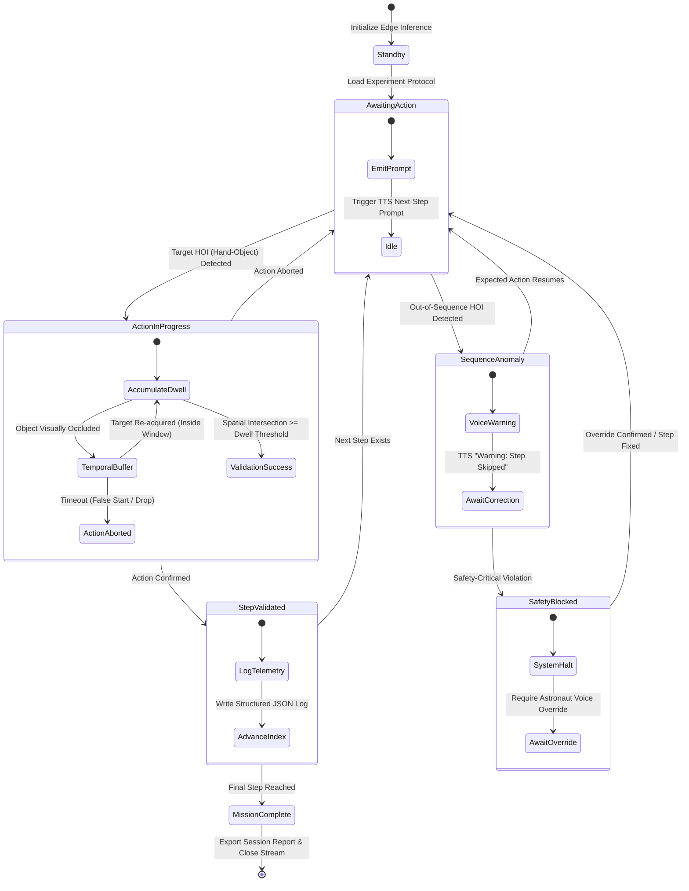

<div align="center">

# 🛰️ AEGIS — BAS Onboard AI Assistant

### Offline, edge-first human activity recognition and protocol safety for BAS experiments

[](https://www.sih.gov.in/)
[](https://www.python.org/)
[](https://fastapi.tiangolo.com/)
[](https://react.dev/)
[](#offline-and-safety-design)

[Overview](#overview) • [Architecture](#system-architecture) • [Repository Guide](#repository-guide) • [Run](#run-the-project) • [Configuration](#configuration) • [API](#api-reference) • [Tests](#testing)

</div>

---

## Overview

**AEGIS** is a Smart India Hackathon 2026 solution for **SIH26174 — AI Human Activity Recognition for On-board BAS Experiments**. It helps an astronaut or payload operator follow an approved procedure by processing a local camera feed, recognizing hand, pose, object, and rack-relative evidence, and validating each action with a deterministic finite-state machine (FSM).

The project is deliberately split into an offline edge pipeline, a FastAPI operations backend, and a React mission-control dashboard. The pipeline is authoritative for perception and protocol state; the web application visualizes and controls that operational truth rather than substituting simulated AI decisions for it.

### What AEGIS delivers

| Capability | Implementation |
| --- | --- |
| Local perception | OpenCV capture, MediaPipe landmarks, optional YOLO/ONNX object detection, tracking, and quality checks |
| Microgravity-ready reference frame | ArUco rack markers and homography-based rack-relative coordinates; no floor or gravity dependency |
| Action recognition | Protocol-derived heuristics, temporal feature windows, optional learned action model, and stability filtering |
| Procedure safety | YAML-defined FSM with expected actions, dwell/debounce, timeout, skip, out-of-sequence, and critical-block handling |
| Operator response | On-screen HUD, offline voice prompts, recordings, local MJPEG stream, structured audit logs, and WebSocket telemetry |
| Operations console | React dashboard for monitoring, experiments, alerts, logs, assistant guidance, digital twin, biometrics, and aerospace status |
| Auditability | SQLite persistence, JSON/text logs, recorded video, CCSDS formatting service, and Merkle-ledger verification |

---

## System Architecture



### Protocol state behavior



The FSM is pure protocol logic: camera, speech, network, recording, and UI concerns sit outside it. This makes safety behavior unit-testable and prevents a slow client or audio subsystem from blocking inference.

---

## Repository Guide

```text
AI-HAR-For-BAS/
├── src/
│   ├── aegis/                 # Primary offline edge runtime
│   │   ├── capture/           # Camera/video input, recording, MJPEG streaming
│   │   ├── perception/        # Rack frame, landmarks, zones, quality, tracking, features
│   │   ├── fusion/            # Evidence, interactions, object and protocol fusion
│   │   ├── protocol/          # Protocol spec and deterministic state engine
│   │   ├── safety/            # Modes, watchdog, and failure injection
│   │   ├── gui/               # Native Tkinter payload-console UI
│   │   ├── tools/             # Calibration, diagnostics, capture, training, model tools
│   │   ├── config.py          # Runtime configuration models and loading
│   │   └── pipeline.py        # End-to-end orchestration
│   └── har/                   # Compatibility HAR pipeline and its unit-tested modules
│       ├── ingestion/         # Frame and camera ingestion
│       ├── vision/            # YOLO, MediaPipe, gesture-recognizer wrappers
│       ├── fusion/            # Interaction/protocol evidence
│       ├── fsm/               # YAML-driven protocol FSM
│       ├── config/            # Legacy-compatible config models and loader
│       └── pipeline.py        # Lightweight HAR pipeline
├── backend/                   # FastAPI mission-operations application
│   ├── routers/               # REST and WebSocket endpoints
│   ├── services/              # Adapter, monitoring, alerts, assistant, safety, ledger, recorder
│   ├── db/                    # SQLAlchemy models, session, and seed data
│   ├── schemas/               # API data-transfer objects
│   ├── config.py              # Environment-driven backend settings
│   └── main.py                # FastAPI application entry point
├── frontend/                  # React + Vite + Tailwind mission-control console
│   └── src/
│       ├── pages/             # Overview, monitoring, experiments, alerts, logs, microgravity
│       ├── components/        # Monitoring, experiment, assistant, layout, chart, and common UI
│       ├── services/          # Backend API client and adapters
│       ├── hooks/             # REST and monitoring-WebSocket hooks
│       └── types/             # Shared frontend types
├── ai_engine/                 # Abstract CV, HAR, NLP, experiment-engine building blocks
├── configs/                   # Runtime, hardware, CPU demo, and protocol YAML files
├── models/                    # Local YOLO, ONNX, MediaPipe, and voice inference assets
├── data/                      # Project data and object-detection input structure
├── datasets/                  # Synthetic red/blue-box training and evaluation dataset
├── scripts/                   # Pipeline, demo, capture, training, dataset, export, benchmark tools
├── tests/                     # Offline unit, integration, safety, fusion, and inference tests
├── docs/                      # Architecture, training, detection, SIH traceability, jury-demo docs
├── database/                  # SQL schema reference
├── storage/                   # Default local SQLite database location
├── logs/                      # Runtime audit logs
├── outputs/                   # Recordings and other generated output
├── INSTALL.bat                # Native pipeline installer
├── START.bat                  # Native AEGIS console launcher
├── INSTALL_WEB.bat            # Web stack dependency installer
└── START_WEB_DASHBOARD.bat    # FastAPI + React dashboard launcher
```

### Which subsystem should you change?

| Goal | Start here |
| --- | --- |
| Change procedure steps, names, timeouts, or safety criticality | `configs/protocol.yaml` |
| Change camera, frame rate, object model, rack markers, stream, or voice settings | `configs/app.yaml` |
| Change core capture, perception, evidence, or safety behavior | `src/aegis/` |
| Change web endpoints, persistence, telemetry, or services | `backend/` |
| Change dashboard visuals or user workflows | `frontend/src/` |
| Build data, train detectors, or run a demo | `scripts/` and `src/aegis/tools/` |
| Understand the SIH requirement mapping | `docs/SIH_REQUIREMENTS.md` |

---

## Run the Project

### Prerequisites

- Windows 10/11 is supported by the supplied `.bat` launchers.
- Python 3.10–3.12 is recommended; Python 3.11 is the safest choice for MediaPipe.
- Node.js 18+ and npm are required for the web dashboard.
- A local camera is optional: the project supports local files and synthetic demonstrations.

### A. Native offline AEGIS console

This path starts the standalone Tkinter payload console and the primary `src/aegis` runtime.

```powershell
.\INSTALL.bat
.\CALIBRATE_ZONES.bat
.\START.bat
```

For an immediate live session with streaming enabled:

```powershell
.\START_LIVE.bat
```

Run diagnostics when a camera, model, voice engine, or port is unavailable:

```powershell
.\DIAGNOSTICS.bat
```

### B. Web mission-operations console

This path starts FastAPI on port `8000` and the React dashboard on port `5173`.

```powershell
.\INSTALL_WEB.bat
.\START_WEB_DASHBOARD.bat
```

| Service | Address |
| --- | --- |
| React mission-control dashboard | `http://localhost:5173` |
| FastAPI backend | `http://127.0.0.1:8000` |
| Interactive OpenAPI documentation | `http://127.0.0.1:8000/docs` |
| Service health | `http://127.0.0.1:8000/health` |

To launch them separately, run `.\START_BACKEND.bat` and `.\START_FRONTEND.bat`.

### C. CLI pipeline and camera-free demo

```powershell
$env:PYTHONPATH = "$PWD\src;$PWD;$PWD\backend"
python scripts/run_pipeline.py --config configs/app.yaml --source 0

# Runs the bundled synthetic SIH protocol demonstration without a camera.
python scripts/run_sih_demo.py
```

---

## Configuration

[`configs/app.yaml`](configs/app.yaml) is the primary edge runtime configuration. The default protocol is [`configs/protocol.yaml`](configs/protocol.yaml), a four-step visible-box procedure: retrieve red box, retrieve the second coloured box, return red box, then return the second coloured box.

| Configuration area | Key settings | Why it matters |
| --- | --- | --- |
| Capture | `video_source`, resolution, FPS, horizontal flip | Selects camera/file/stream input and frame behavior |
| Rack frame | ArUco marker IDs and calibration | Converts image coordinates into rack-relative coordinates |
| Perception | pose/hands enablement, detector model, confidence, providers | Balances accuracy and edge compute budget |
| Recognition | temporal window, confidence, stability frames | Governs when a recognition becomes trustworthy evidence |
| Output | voice, logs, recording, stream host/port/push URL | Enables operator response and evidence retention |
| Protocol | `protocol_path`, steps, expected evidence, timeouts | Defines exactly what the FSM will accept |

Backend settings are read from `.env` through `backend/config.py`. The important values are `DATABASE_URL`, `DEMO_MODE`, `CONFIDENCE_THRESHOLD`, `FRAME_BUFFER_SIZE`, and `INFERENCE_INTERVAL_MS`. SQLite is the default; PostgreSQL is supported through `DATABASE_URL`.

---

## Data, Models, and Training

### Bundled local assets

- `models/exported/best.pt` — YOLO weights used by the compatibility HAR pipeline.
- `models/objects/objects.onnx` — ONNX object detector used by the AEGIS pipeline.
- `models/gesture_recognizer.task` — MediaPipe gesture recognition task model.
- `models/voice/` — bundled local voice model assets.
- `datasets/red_blue_synth/` — synthetic red/blue-box images and YOLO labels.
- `data/tool_detection/` and `data/sih_box_experiment/` — project-specific detection data layouts.

### Useful commands

| Task | Command or launcher |
| --- | --- |
| Record action clips | `.\RECORD_DATASET.bat` |
| Train action model | `.\TRAIN_MODEL.bat` |
| Train object model | `.\TRAIN_OBJECTS.bAT` |
| Generate rack markers | `.\MAKE_ARUCO_MARKERS.bat` |
| Capture object images | `python scripts/capture_dataset.py --class-name red_box` |
| Generate synthetic red/blue images | `python scripts/generate_synthetic_red_blue_dataset.py` |
| Export an inference model | `python scripts/export_engine.py` |
| Evaluate models | `python scripts/evaluate_models.py` |

See `docs/TRAINING.md`, `docs/OBJECT_DETECTION.md`, and `docs/synthetic_dataset_red_blue_boxes.md` for the full data and training workflow.

---

## API Reference

The FastAPI backend mounts versioned operations APIs beneath `/api/v1` and streams monitoring data through `/ws/monitoring`.

| Area | Examples |
| --- | --- |
| System | `GET /health`, `GET /api/v1/system/status`, `GET /api/v1/system/environment` |
| Dashboard and experiments | `GET /api/v1/dashboard`, `GET /api/v1/experiments` |
| Monitoring | `POST /api/v1/monitoring/start`, `POST /api/v1/monitoring/stop/{session_id}`, `GET /api/v1/monitoring/stream` |
| Alerts and logs | `GET /api/v1/alerts`, `POST /api/v1/alerts/{alert_id}/acknowledge`, `GET /api/v1/logs` |
| Assistant | `POST /api/v1/assistant/chat`, `GET /api/v1/assistant/guidance` |
| Aerospace operations | telemetry, biometrics, TTS, and Merkle verification endpoints under `/api/v1/aerospace` |
| Live updates | `WS /ws/monitoring` |

Use the running service’s `/docs` page as the canonical interactive contract.

---

## Testing

The test suite is designed to run without a camera or GPU.

```powershell
.\RUN_TESTS.bat
```

Or run focused modules directly:

```powershell
$env:PYTHONPATH = "$PWD\src"
python -m pytest tests/test_fusion_and_fsm.py tests/test_sih_box_protocol.py -q

cd frontend
npm run typecheck
npm run build
```

The test coverage includes protocol transitions, safety blocking and recovery, fusion evidence, rack-frame geometry, configuration, local output, ONNX export, detection, and end-to-end smoke paths.

---

## Offline and Safety Design

- The inference path is local and designed to work without cloud AI APIs.
- The protocol FSM—not a language model—is the authority for experiment progression and violations.
- Rack-relative features avoid assumptions about gravity or an upright astronaut.
- Capture, inference, recording, streaming, voice, and UI are isolated so a slow output does not halt perception.
- Critical bypasses are represented as a distinct blocked state, allowing the audit trail to separate recovery from failure.
- Model, calibration, and fallback status are exposed to the operator instead of silently masking degraded operation.

---

## Documentation

| Document | Purpose |
| --- | --- |
| `docs/ARCHITECTURE.md` | Detailed edge-pipeline architecture and design decisions |
| `docs/SIH_REQUIREMENTS.md` | Requirement traceability for SIH26174 |
| `docs/JURY_DEMO.md` | Suggested jury demonstration flow |
| `docs/TRAINING.md` | Action-model training workflow |
| `docs/OBJECT_DETECTION.md` | Object detection workflow and model use |
| `docs/ROUND2_IMPLEMENTATION_PLAN.md` | Round-two engineering plan |
| `AI_HAR_Architecture_and_Roadmap.md` | Project roadmap |
